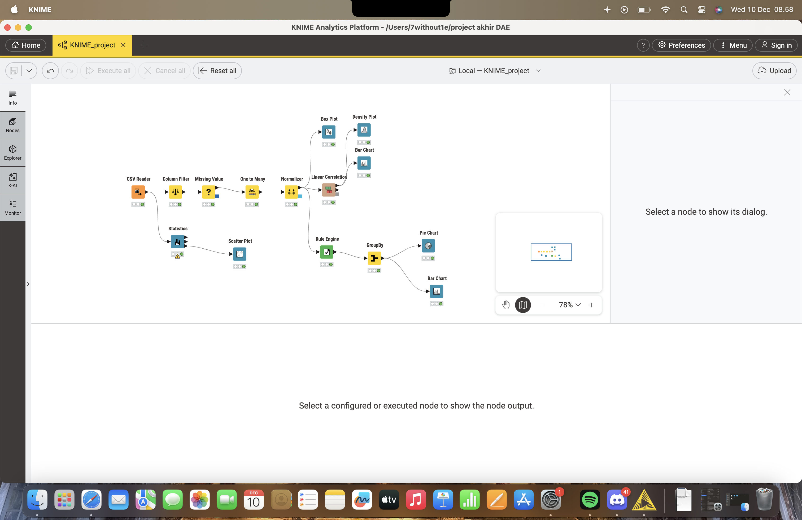

# 🚗 Proyek Analisis Prediksi Harga Mobil Toyota Corolla

Proyek ini merupakan analisis eksplorasi data dan pemodelan regresi awal menggunakan dataset `ToyotaCorolla.csv`. Tujuan utamanya adalah memahami faktor-faktor yang mempengaruhi harga jual mobil, dengan fokus pada hubungan antara **Usia Mobil** dan **Jarak Tempuh (KM)**.

)

## 💾 Dataset

Dataset: `ToyotaCorolla.csv`
Sumber: Data historis penjualan mobil Toyota Corolla.

| Variabel | Deskripsi | Tipe Data |
| :--- | :--- | :--- |
| `Price` | Harga jual mobil (Variabel Target) | Numerik (Integer) |
| `Age_08_04` | Usia mobil dalam bulan pada tanggal penawaran | Numerik (Integer) |
| `KM` | Jarak tempuh mobil dalam kilometer | Numerik (Integer) |
| `HP` | Tenaga kuda (*Horse Power*) | Numerik (Integer) |
| `Weight` | Berat mobil | Numerik (Integer) |
| `Fuel_Type` | Jenis bahan bakar (Petrol, Diesel, CNG) | Kategorikal |

## ⚙️ Pengaturan dan Eksperimen

Berdasarkan *screenshot* yang disediakan (menunjukkan *workflow* di Orange Data Mining atau platform serupa), proyek ini menggunakan alur kerja sebagai berikut:

1.  **Input Data**: Memuat `ToyotaCorolla.csv`.
2.  **Pemilihan Fitur**: `Price` ditetapkan sebagai variabel Target, sementara `Age_08_04`, `KM`, `HP`, `Weight`, dll., digunakan sebagai Variabel Prediktor.
3.  **Model Regresi**: Digunakan untuk memprediksi `Price`.
4.  **Evaluasi (*Test and Score*)**: Menggunakan metrik seperti $R^2$ (untuk goodness-of-fit) dan RMSE/MAE (untuk mengukur kesalahan prediksi model).

## 📊 Visualisasi Data Utama dan Insight

Visualisasi di bawah ini memperjelas hubungan antara variabel prediktor utama (`Age_08_04` dan `KM`) dengan variabel target (`Price`).

### 1. Hubungan antara Umur Mobil (Bulan) dan Harga

Visualisasi ini menunjukkan hubungan antara usia mobil (dalam bulan) dan harga jualnya.

#### **Insight dari Grafik Umur vs Harga:**

1.  **Korelasi Negatif Kuat:** Terdapat hubungan negatif yang jelas. Semakin tua usia mobil (`Age_08_04` meningkat), harga mobil (`Price`) cenderung menurun secara drastis.
2.  **Depresiasi Cepat:** Penurunan harga sangat cepat terjadi dalam rentang usia muda hingga menengah.
3.  **Variasi Harga:** Variasi harga mobil pada usia muda (di bawah 30 bulan) lebih lebar, menunjukkan pengaruh faktor lain selain usia (seperti jenis model atau fitur) pada mobil yang relatif baru.

---

### 2. Hubungan antara Jarak Tempuh (KM) dan Harga

Visualisasi ini menunjukkan hubungan antara jarak tempuh mobil (dalam KM) dan harga jualnya.

#### **Insight dari Grafik Jarak Tempuh vs Harga:**

1.  **Korelasi Negatif:** Mirip dengan usia, ada korelasi negatif. Semakin tinggi jarak tempuh (`KM`), semakin rendah harga jualnya.
2.  **Penurunan Signifikan:** Harga akan mengalami penurunan yang signifikan ketika jarak tempuh melampaui ambang batas tertentu (misalnya, di atas 100.000 KM), yang merupakan titik kritis dalam persepsi nilai mobil bekas.
3.  **Prediktor Penting:** Baik usia maupun jarak tempuh adalah prediktor yang sangat kuat dan harus menjadi komponen inti dalam model prediksi harga mobil.

## 🐍 Kode Analisis

Kode Python untuk memuat data dan menghasilkan visualisasi di atas tersedia dalam file: [`data_analysis.py`](data_analysis.py).
